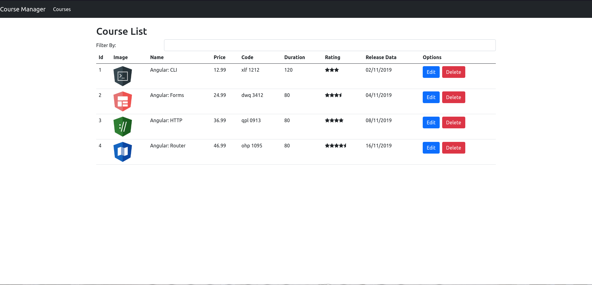
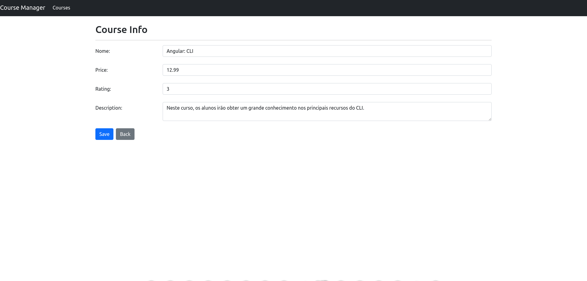

# Angular Course Manager (Basic CRUD)

This is my first project using Angular and it's a basic **CRUD** (**Create**, **Retrieve**, **Update**, **Delete**), using **Angular**. This project was created during the course **Introdução ao Angular 8** on the **Santander Bootcamp | FullStack Developer** in the **Digital Innovation One** platform. The project uses **Bootstrap** and **FontAwesome** for styles and icons.

The **Back-end** of this project was a mock api using **json-server** package and the initial data is found on the **db.json** file at root of the project path.


## Demo





## Run Locally

Clone the project

```bash
git clone https://github.com/EduardoJM/angular-course-manager
```

Go to the project directory

```bash
cd angular-course-manager
```

Install dependencies

```bash
npm install
```

Start the Mock API Back-End

```bash
npm run db
```

Start the server

```bash
npm run start
```

or 

```bash
ng serve
```
## Authors

- GitHub: [@EduardoJM](https://www.github.com/EduardoJM)
- Twitter: [@edu_js_o](https://twitter.com/edu_js_o)
- LinkedIn: [/edujso](https://www.linkedin.com/in/edujso/)

